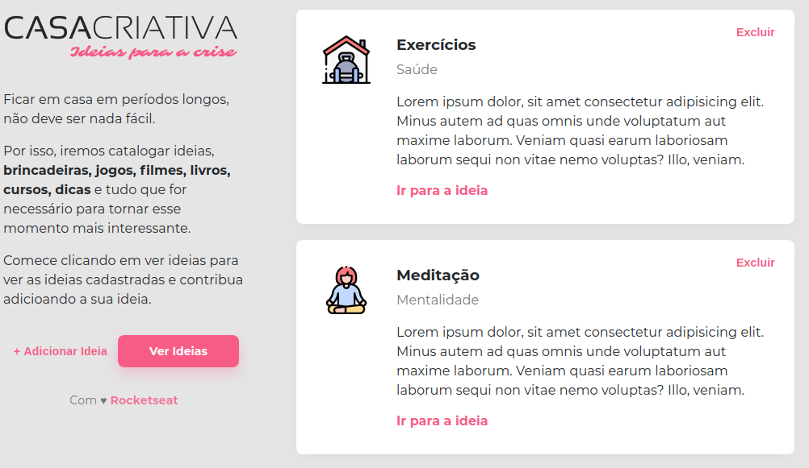
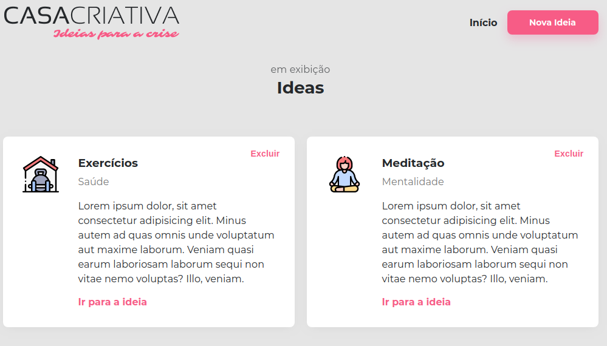

<div align="center">
    <h1></h1>
    <p>Site para o cadastro e a consulta de ideias</p>
    
    
</div>

## Requisitos:
- Nodejs
- npm

## Instalação
1) Baixe o repositório: ```git clone https://github.com/Lucas-Severo/CasaCriativa.git```
2) Entre na pasta app: ```cd CasaCriativa/app```
3) Instale as dependências: ```npm install```
4) Executa o aplicativo: ```npm start```

## Execução

Para a visualização do site, entre em seu no navegador <a href="http://127.0.0.1:3000">http://127.0.0.1:3000</a>